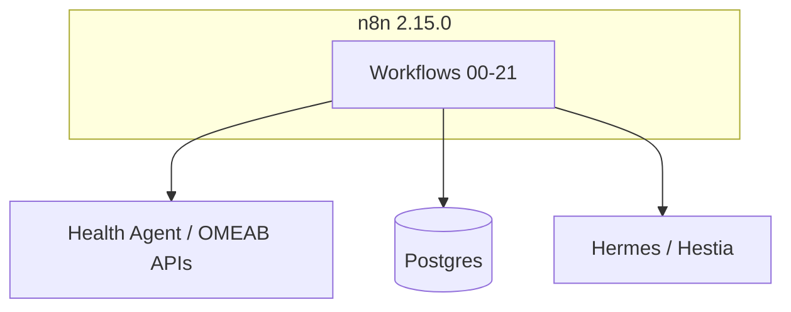

# Visão geral do hub

```mermaid
flowchart TB
  subgraph n8n [n8n 2.15.0]
    W[Workflows 00-21]
  end
  HA[Health Agent / OMEAB APIs]
  PG[(Postgres)]
  H[Hermes / Hestia]
  W --> HA
  W --> PG
  W --> H
```
